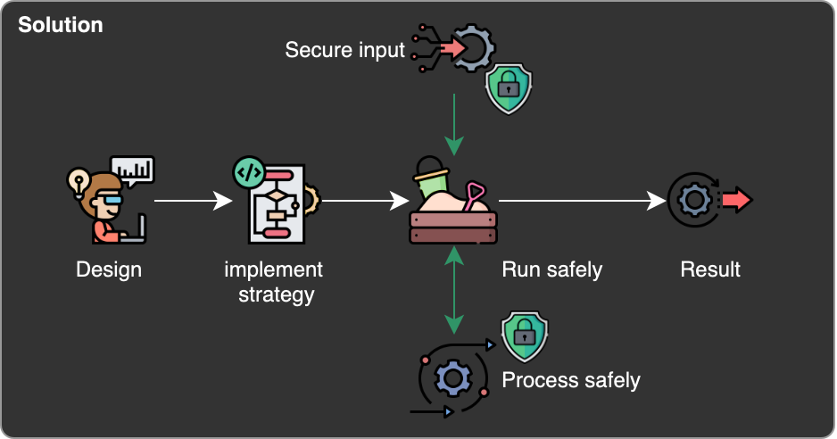
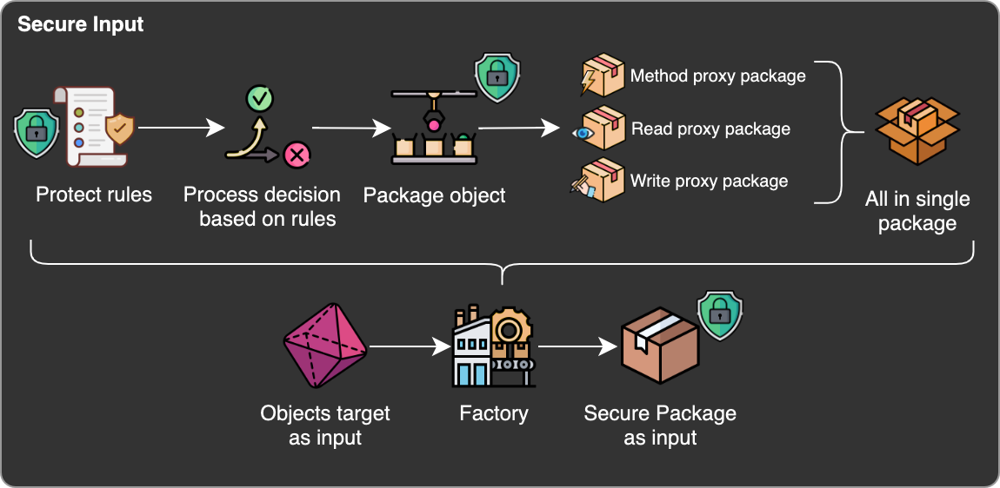
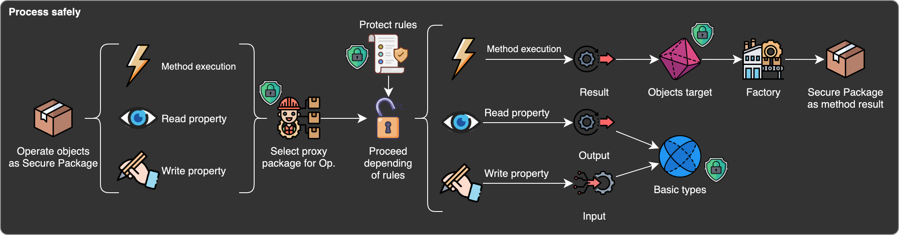
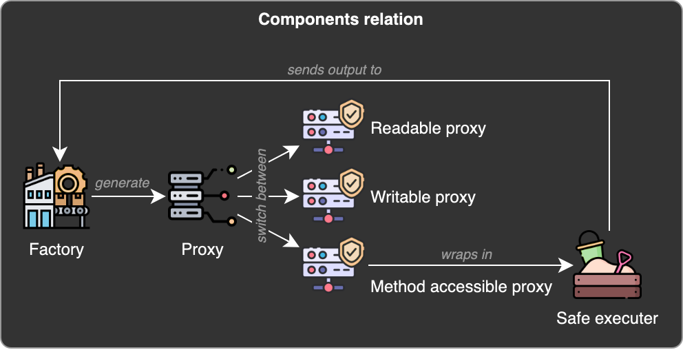

# 🪐 Interstellar War Dilemma: Design Galactic Strategies with AI Assistance! 🤖🚀

**Interstellar War Dilemma** is a thrilling multiplayer simulation game where each player creates their own strategy to lead a civilization through stellar battles. 🌟 The goal is simple: decide when to **cooperate** or **attack** in each skirmish while managing resources, analyzing opponent behavior, and considering the planet's cost. 🛠️

Best of all, **you don't need to be a coding expert!** 🧑‍💻 With the help and power of a generative AI assistance , you'll be guided through designing your strategy in Python, providing you with smart suggestions and even ready-to-use code. 🎯

### ⚡ Key Features:
- 🧠 **Strategic decisions** based on past opponent behavior, available resources, and planetary context.
- 🚀 **AI assistance** so you can design and code your strategy without needing advanced programming skills.
- 🔥 **Dynamic skirmishes** with various costs and vulnerabilities that challenge your tactical abilities.
- 🎮 **Join the galactic challenge!** Create, refine, and deploy your strategy to lead your civilization to victory among the stars. 🌌

## Technical stuff
### Security
- **Runtime access** managed through the use of secure proxies applied to function input arguments, combining some design patterns.
  - [**Proxy Pattern**](https://refactoring.guru/design-patterns/proxy): Objects passed to the strategies are wrapped in a proxy, which controls access to methods and attributes. This ensures security and that only allowed actions can be performed.
  - [**Decorator Pattern**](https://refactoring.guru/design-patterns/decorator): Proxies function as decorators, adding functionality to objects without changing their internal structure.
  - [**Factory Pattern**](https://refactoring.guru/design-patterns/factory-method): The factory creates proxy instances based on the type of object to be secured. It also returns customized proxies depending on the allowed attributes and methods for each object.

## Annexes
- Security: 
  - Secure Proxy frame solution.
  
  - Solution ensures secure access to input objects.
  
  - Solution ensures secure processing in strategy runtime.
  
  - Components of the secure proxy frame.
  

## ToDos
- [ ] Solve bloat time execution of +2.75% / round in SkirmishUseCases.resolve
- [ ] Analyze vs balances in opponents selection across rounds 