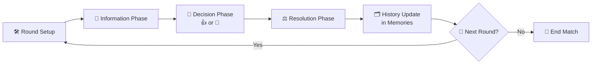
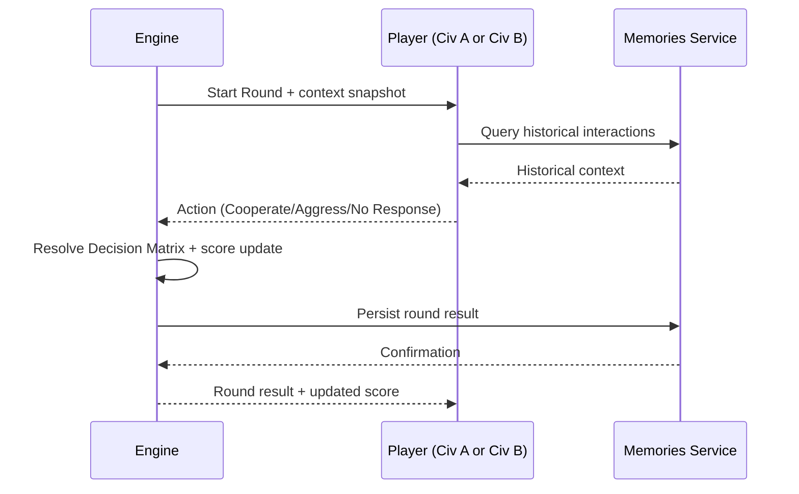

# Interstellar War Dilemma
A turn-based strategy simulation inspired by the Prisoner's Dilemma.

In the current core version, each player controls a civilization and only decides one action per skirmish:

- `👍` Cooperate
- `🖕` Aggress
- `⛔️` No Response (timeout or unavailable player)

Decisions are made using available match information and historical context queried through the `Memories` service.

## Decision Matrix

| Civilization A | Civilization B | Resolution        |
|----------------|----------------|-------------------|
| 👍 3           | 👍 3           | 🤝 Cooperation    |
| 🖕 5           | 👍 0           | 🗿 Betrayal_A     |
| 👍 0           | 🖕 5           | 🗿 Betrayal_B     |
| 🖕 1           | 🖕 1           | ⚔️ Conflict       |
| ⛔️ 1           | ⛔️ 1           | 🚫 No Response    |
| ⛔️ 1           | 👍 2           | ❌ No Cooperate_A |
| 👍 2           | ⛔️ 1           | ❌ No Cooperate_B |
| ⛔️ 0           | 🖕 5           | 🩸 Massacre_A     |
| 🖕 5           | ⛔️ 0           | 🩸 Massacre_B     |

Scores in each cell are represented as `Action Score` for each civilization.

## Core Gameplay (MVP)

This project is intentionally focused on the simulation core. A player does not control movement, economy, or territory in this stage. The player role is to choose a strategy per skirmish.

Round flow:

```mermaid
flowchart LR
	A[🛠️ Round Setup] --> B[🧠 Information Phase]
	B --> C[🎯 Decision Phase
            👍 or 🖕]
	C --> D[⚖️ Resolution Phase]
	D --> E[🗂️ History Update
            in Memories]
	E --> F{🔁 Next Round?}
	F -- Yes --> A
	F -- No --> G[🏁 End Match]
```

```mermaid
sequenceDiagram
	participant E as Engine
	participant P as Player (Civ A or Civ B)
	participant M as Memories Service

	E->>P: Start Round + context snapshot

	P->>M: Query historical interactions
	M-->>P: Historical context

	P-->>E: Action (Cooperate/Aggress/No Response)

	E->>E: Resolve Decision Matrix + score update
	E->>M: Persist round result
	M-->>E: Confirmation

	E-->>P: Round result + updated score
```

1. **Round Setup**: The engine creates pairings and provides the information snapshot.
2. **Information Phase**: Each player reviews available context, including `Memories` query results.
3. **Decision Phase**: Each player selects `Cooperate`, `Aggress`, or gets `No Response`.
4. **Resolution Phase**: The engine applies the Decision Matrix and assigns scores.
5. **History Update**: The result is stored in historical records for future decisions.

## Technical Specification

The technical functional contract for implementing the engine is documented in [doc/rules-spec.md](doc/rules-spec.md).

## Victory Condition

The victory condition is intentionally open in the current core version.

This allows running different simulation objectives without changing the decision engine (for example: fixed rounds, score threshold, or custom tournament rules).

## Space for Expansion

Possible future expansions include:
- richer galaxy hierarchy and territorial layers,
- advanced resource and movement systems,
- additional strategy presets and tournament formats.

## Future Direction (Not in MVP)

The core simulation is designed to scale later into a platform model with:
- REST API orchestration,
- WebHook callbacks for player decisions,
- player-hosted servers distributed as Docker images.

For now, this repository focuses only on the decision simulation core.

## Out of Scope (Current Core)

- Cybersecurity attack/defense gameplay.
- Player authentication server implementation.
- Full infrastructure orchestration for external server integration.