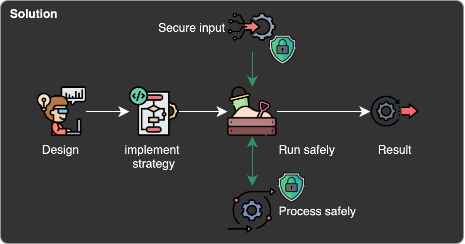

# 🪐 Interstellar War Dilemma: Strategic AI-Assisted Game Core

**Interstellar War Dilemma** is a strategic simulation game based on the **Prisoner's Dilemma** in a space exploration context. Players create strategies to lead civilizations through stellar encounters, deciding when to **cooperate** or **attack** while managing resources and analyzing opponent behavior patterns.

## 🚀 Vision & Approach

### Core Principles
- **Security First**: All strategy execution happens through secure proxies
- **Didactic Focus**: Learn through iteration and strategy comparison
- **AI Assistance**: From Python templates to natural language strategy definition
- **Batch Processing**: Run multiple epochs to analyze strategy performance

### Target Audience
- 🎓 **Beginners**: Learn game theory through hands-on experimentation
- 🧑‍💻 **Developers**: Explore secure code execution and AI integration
- 🎮 **Strategists**: Test and refine decision-making algorithms
- 📊 **Analysts**: Study emergent behavior patterns in multi-agent systems

## 🏗️ Architecture Overview

  ```
  📁 interstellar-war-dilemma/
  ├── 📁 app/
  │   └── 📁 core/
  │       └── 📁 domain/
  │           ├── models.py               # Entities
  │           ├── models.spec.py          # Models tests
  │           ├── value_objects.py        # Immutable value types
  │           └── value_objects.spec.py   # Value objects tests
  ├── 📁 doc/
  │   ├── DEVELOPER_TASKS.md
  │   ├── API_REFERENCE.md
  │   ├── STRATEGY_GUIDE.md
  │   └── 📁 assets/
  ├── 📁 config/
  ├── Dockerfile
  ├── docker-compose.yml
  └── pyproject.toml
  ```


### Phase 1: Core Foundation (In Progress)
```
Domain Models → Security Proxies → Memory Systems
```

### Phase 2: Game Logic Engine
```
Batch Execution → Performance Analytics → Strategy Validation
```

### Phase 3: AI Integration
```
Pydantic AI → Template System → Natural Language Interface
```

## 🔒 Security Architecture

Strategic code execution is secured through a **multi-pattern proxy system**:

- **[Proxy Pattern](https://refactoring.guru/design-patterns/proxy)**: Controls access to game objects and methods
- **[Decorator Pattern](https://refactoring.guru/design-patterns/decorator)**: Adds security layers without modifying core objects
- **[Factory Pattern](https://refactoring.guru/design-patterns/factory-method)**: Creates customized security proxies based on object types




## 🎮 Game Mechanics Preview

### Strategy Function Interface
```python
def strategy(
    planet: AstronomyBody,
    opponent: Civilization,
    memories: Memories,
    resources: Resources
) -> Position:
    """
    Your strategy decides: COOPERATE or ATTACK
    Based on: planet cost, opponent history, available resources
    """
    # Your strategic logic here
    return Position.COOPERATE  # or Position.ATTACK
```

### Memory System (Secure Access)
```python
# Secure access to historical data
previous_encounters = memories.get_encounters_with(opponent)
success_rate = memories.calculate_cooperation_success()
resource_trends = memories.analyze_resource_efficiency()
```

## 📚 Documentation

- [Developer Tasks](docs/DEVELOPER_TASKS.md) - Detailed implementation roadmap
- [Architecture Diagrams](doc/assets/images/) - Visual system design
- [Security Framework](doc/assets/images/strategy_proxy_frame_solution.drawio.png) - Proxy pattern implementation

---

*Built with focus on security, education, and AI-assisted strategic thinking* 🚀