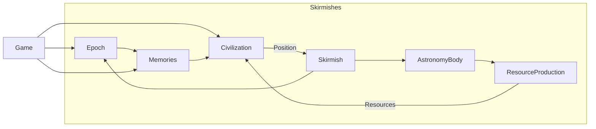
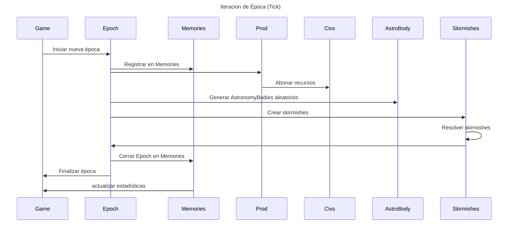
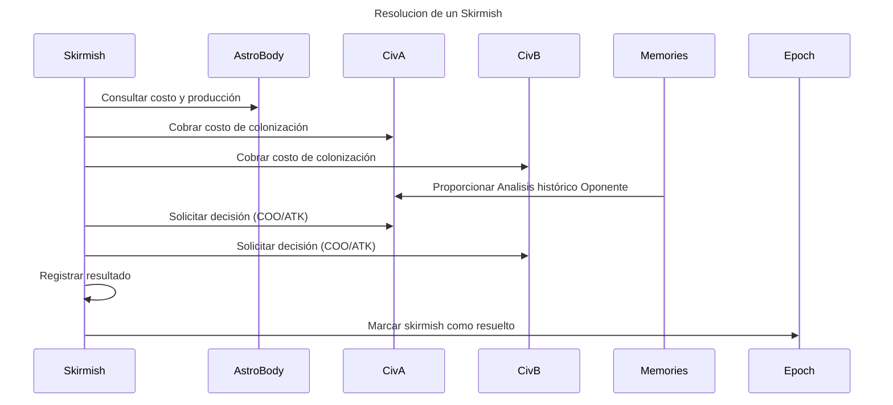
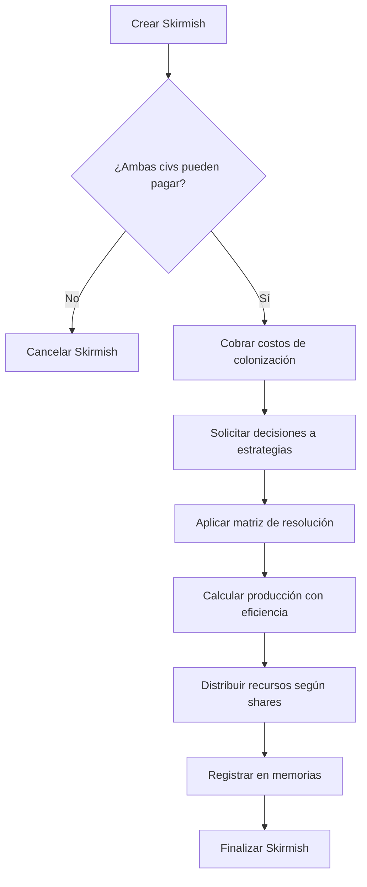
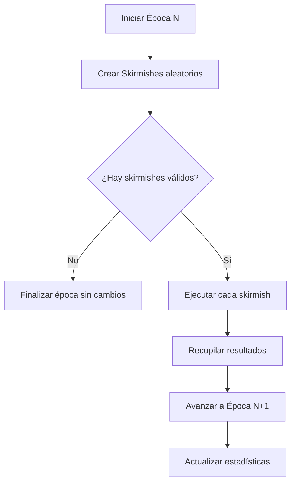

# 🚀 Análisis de Dominio: Interstellar War Dilemma

## 📋 Conceptos del Dominio

### 🏛️ Entidades Principales

#### 🏴‍☠️ **Civilization** (Entidad Central)
  - **Estado**: `ACTIVE` -> (`DECLINING`, `DEAD`)
  - **Recursos**: `Resources` (Valor)
  1. Mantener recursos actuales
  2. Recibir recursos de producción por Epoca
  3. Pagar costos de colonización
  4. Ejecutar estrategia de decisión (Area de acción del jugador)

#### 🪐 **AstronomyBody** (Entity)
  - **Estado**: `AVAILABLE` -> (`DISPUTED`, `LOST`)
  - **Costo de Colonización**: `ResourceRange` (0-5)
  - **Produccion**: `ResourceRange` (0-3)
  1. Ser el objetivo de disputa

#### 💰 **ResourceProduction** (Entity)
  - **Civilizacion**: `Civilization`
  - **AstronomyBody**: `AstronomyBody`
  - **Participación**: `Participation` (IntEnum)
  1. Resolver producción de recursos según participación

#### ⚔️ **Skirmish** (Entity)
  - **Estados**: `CREATED` → `EXECUTED` → `RESOLVED`
  - **Civilizacion A**: `Civilization`
  - **Civilizacion B**: `Civilization`
  - **Decision A**: `Position`
  - **Decision B**: `Position`
  - **Resultado para A**: `SkirmishResult`
  - **Resultado para B**: `SkirmishResult`
  - **Producción A**: `ResourceProduction`
  - **Producción B**: `ResourceProduction`
  1. Cobrar costos de colonizacion
  2. Resolver resultado según matriz
  3. Definir porcentajes de produccion de recursos

#### 🕰️ **Epoch** (Entity)
  - **Estado**: `FUTURE` -> `CURRENT` -> `HISTORIC`
  - **Skirmishes**: Lista de `Skirmish`
  1. Generar AstronomyBodies aleatorios
  2. Agrupar todos los skirmishes de una ronda

#### 🧠 **Memories** (Entity)
  - **Epocas**: Lista de `Epoch`
  - **Propietario**: `Civilization`
  1. Registrar epocas de skirmishes filtrando por propietario
  2. Permitir análisis histórico
  3. Permitir consultas avanzadas

#### 🎮 **Game** (Aggregate Root)
  - **Civilizaciones**: Lista de `Civilization`
  - **Memorias**: Lista de `Memories`
  1. Orquestar épocas secuenciales
  2. Mantener estadísticas globales
  3. Controlar estados de muerte
  4. Asegurar participación de todas las civilizaciones

## 🔄 Objetos de Valor

### **Resources**
```
- energy: Int
- materials: Int  
- population: Int
+ operaciones inmutables (add, subtract, multiply)
```

### **Position** (Enum)
```
- COOPERATE: Decisión colaborativa
- ATTACK: Decisión agresiva  
- NOTHING: Fallo en decisión o inacción
```

### **SkirmishResult**
```
- decision_a: Position
- decision_b: Position
- efficiency_a: Float (0.0-1.0) - Eficiencia individual de Civ A
- efficiency_b: Float (0.0-1.0) - Eficiencia individual de Civ B
- both_control: Boolean
- astronomy_body_status: AstronomyBodyStatus (CONTROLLED, DISPUTED, LOST)
```

### **AstronomyBodyStatus** (Enum)
```
- CONTROLLED: Al menos una civilización obtuvo recursos
- DISPUTED: Ambas civilizaciones fallaron, se vuelve a disputar next epoch
- LOST: Nadie hizo nada, el AstronomyBody se pierde permanentemente
```


## 🧩 Relaciones entre Entidades








## 📊 Matriz de Resolución de Skirmishes

| Civ A ↓ / Civ B → | **COOPERATE** | **ATTACK** | **NOTHING** |
|-------------------|---------------|------------|-------------|
| **COOPERATE**     | A: 50% - B: 50%<br/>*Ambos controlan*<br/>*Status: CONTROLLED* | A: 0% - B: 83%<br/>*Solo B controla*<br/>*Status: CONTROLLED* | A: 67% - B: 17%<br/>*Ambos controlan*<br/>*Status: CONTROLLED* |
| **ATTACK**        | A: 83% - B: 0%<br/>*Solo A controla*<br/>*Status: CONTROLLED* | A: 17% - B: 17%<br/>*Ambos controlan*<br/>*Status: CONTROLLED* | A: 83% - B: 0%<br/>*Solo A controla*<br/>*Status: CONTROLLED* |
| **NOTHING**       | A: 17% - B: 67%<br/>*Ambos controlan*<br/>*Status: CONTROLLED* | A: 0% - B: 83%<br/>*Solo B controla*<br/>*Status: CONTROLLED* | A: 0% - B: 0%<br/>*Nadie controla*<br/>*Status: DISPUTED → LOST* |

### 📈 Interpretación de la Matriz:
- **Cooperación mutua**: Máximo beneficio conjunto (50%-50%)
- **Conflicto mutuo**: Mínimo beneficio, máximo desperdicio (17%-17%)
- **Traición**: El agresor gana más (83% vs 0%)
- **Inacción total**: AstronomyBody se marca como DISPUTED, si se repite → LOST permanentemente

---

## 🎯 Flujo de Procesos

### **Proceso: Ejecutar Skirmish**


### **Proceso: Ejecutar Época**


---

## 🧠 Sistema de Memoria Global

### **MemoryEntry** (Objeto de Valor)
```
- skirmish_id: SkirmishId
- civ_a_id: CivilizationId
- civ_b_id: CivilizationId
- astronomy_body_id: AstronomyBodyId
- decision_a: Position
- decision_b: Position
- efficiency_a: Float (0.0-1.0)
- efficiency_b: Float (0.0-1.0)
- astronomy_body_status: AstronomyBodyStatus
- epoch: Int
- resources_gained_a: Resources
- resources_gained_b: Resources
```

### **MemoryAccess** (Filtro por Civilización)
```
- owner_id: CivilizationId
- access_level: MemoryAccessLevel (OWN, ALLIED, GLOBAL)
- limit: Int (default: 100, expandible con mecánicas futuras)
```

### **Queries de Memoria Mejoradas**:
- `getEncountersWith(opponent)`: Historial con civilización específica
- `calculateCooperationSuccessRate()`: % de veces que cooperar dio resultado positivo
- `analyzeOpponentBehavior(opponent)`: Patrones de comportamiento del oponente
- `getResourceTrends(opponent)`: Tendencias históricas de recursos del oponente
- `analyzeCivilizationState(opponent)`: Estado actual vs histórico del oponente
- `evaluateAstronomyBodyProfitability(body)`: Rentabilidad histórica de un AstronomyBody
- `recommendAction(body, opponent, current_resources)`: Sugerencia basada en análisis completo
- `getDeathWatch()`: Lista de civilizaciones en riesgo de muerte (próximas 2 épocas)

---

## 🎮 Interfaces de Estrategia

### **Strategy Protocol**
```python
def decide(
    astronomy_body: AstronomyBody,
    opponent: Civilization,
    memory_access: MemoryAccess,  # Acceso filtrado a memorias
    current_resources: Resources
) -> Position
```

### **Ejemplos de Estrategias**:
1. **AlwaysCooperate**: Siempre coopera
2. **AlwaysAttack**: Siempre ataca  
3. **TitForTat**: Imita la última acción del oponente
4. **Grudger**: Coopera hasta ser traicionado, luego siempre ataca
5. **Random**: Decisión aleatoria
6. **ResourceBased**: Decide según recursos disponibles vs costo
7. **MemoryAnalyst**: Analiza historial completo antes de decidir
8. **OpponentTracker**: Se especializa en rastrear patrones de comportamiento
9. **ProfitMaximizer**: Siempre busca máximo retorno de inversión
10. **Survivor**: Prioriza supervivencia sobre ganancias

---

## 🔮 Extensiones Futuras

### **Mecánicas Avanzadas**:
1. **Exploración Interestelar**:
   - Permitir "divisar" astronomy bodies futuros
   - Costo en recursos para explorar
   - Información parcial sobre targets

2. **Worm Holes**:
   - Requiere exploración previa
   - Permite influir en probabilidad de encounters
   - Costo premium en recursos

3. **Tecnologías**:
   - Mejoras de eficiencia de producción
   - Reducción de costos de colonización
   - Nuevas opciones de decisión

4. **Diplomacia**:
   - Alianzas temporales
   - Pactos de no agresión
   - Intercambio directo de recursos

### **Tipos de AstronomyBody**:
- **Planet**: Alto costo, alta producción, estable
- **Moon**: Costo medio, producción media, vinculado a planetas
- **Star**: Altísimo costo, altísima producción, muy raro
- **Stellar Structure**: Costo variable, producción especializada
- **Asteroid**: Bajo costo, baja producción, abundante
- **Space Station**: Costo premium, producción eficiente, tecnológico

---

## 🚀 Mecánicas Futuras - Brainstorming

### **🤝 Sistema de Alianzas**:
- **Compartir Memorias**: Aliados acceden a memoria histórica mutua
- **Intercambio de Recursos**: Trueques automáticos o manuales
- **Coordinación de Estrategias**: Decisiones conjuntas en algunos skirmishes
- **Duración**: Alianzas temporales (X épocas) o hasta traición

### **🔭 Exploración Interestelar**:
- **Prospección**: Gastar recursos para ver AstronomyBodies de futuras épocas
- **Información Parcial**: Solo tipo y costo, no producción exacta
- **Ventaja Estratégica**: Preparación para targets valiosos

### **🌌 Worm Holes**:
- **Requisito**: Exploración previa del target
- **Funcionalidad**: Aumentar probabilidad de ser asignado a AstronomyBody específico
- **Costo Premium**: Muy caro pero estratégicamente valioso

### **⚙️ Tecnologías**:
- **Eficiencia de Producción**: Multiplicadores en recursos obtenidos
- **Reducción de Costos**: Descuentos en colonización
- **Nuevas Opciones**: Decisiones adicionales como "SABOTAGE" o "FORTIFY"
- **Árbol Tecnológico**: Prerrequisitos y especializaciones

### **📊 Análisis Avanzado**:
- **Predicción de Comportamiento**: IA que predice decisiones de oponentes
- **Simulador de Scenarios**: Probar estrategias sin gastar recursos
- **Market Intelligence**: Análisis de tendencias del "mercado" de AstronomyBodies

### **🎲 Eventos Aleatorios**:
- **Catástrofes**: Pérdida súbita de recursos
- **Discoveries**: Bonificaciones inesperadas
- **Mercado Fluctuante**: Cambios en costos/producciones de AstronomyBodies

### **💾 Expansión de Memoria**:
- **Límite Base**: 100 entradas por civilización
- **Upgrades**: Tecnologías que expanden capacidad
- **Memoria Especializada**: Tipos específicos de memoria (combate, recursos, diplomacia)

---

## 🎲 Mecánicas de Aleatoriedad

### **Asignación de Skirmishes**:
- **Obligatorio**: Todas las civilizaciones deben participar cada época
- **Números impares**: El juego agrega automáticamente una "NeutralCivilization" con estrategia aleatoria
- **Emparejamiento**: Aleatorio pero garantizando que todos participen
- **Restricción**: Solo si ambas pueden pagar (civilizaciones pobres saltan la época)

### **Gestión de Civilizaciones en Quiebra**:
- **Estado de Muerte**: Se activa cuando no pueden pagar ningún AstronomyBody durante 2 épocas consecutivas
- **Supervivencia**: Tienen 2 épocas adicionales para recuperarse antes de eliminación definitiva
- **Interacción**: Pueden seguir siendo atacadas pero no pueden iniciar skirmishes

### **Variabilidad Futura**:
- Eventos aleatorios que afectan recursos
- Astronomy bodies que aparecen/desaparecen
- Modificadores temporales de eficiencia

---

## 📊 Métricas y Análisis

### **Estadísticas por Civilización**:
- Total de recursos actuales
- Número de skirmishes ganados/perdidos/empatados
- Tasa de cooperación histórica
- Eficiencia promedio obtenida
- Astronomy bodies controlados

### **Estadísticas Globales**:
- Distribución de recursos entre civilizaciones
- Patrones de comportamiento emergentes
- Astronomy bodies más disputados
- Evolución de estrategias a lo largo del tiempo
