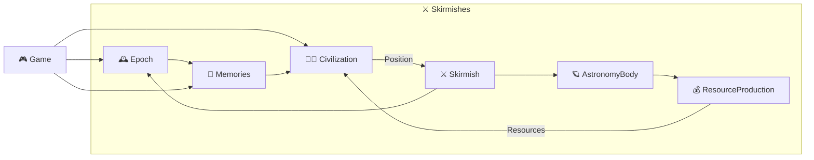
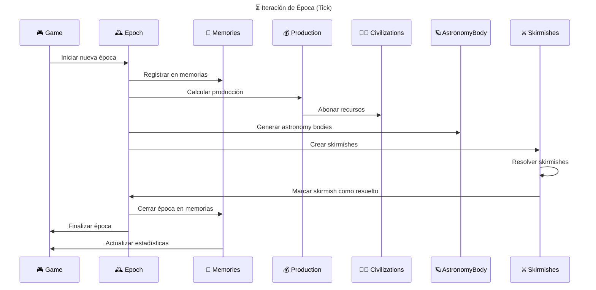
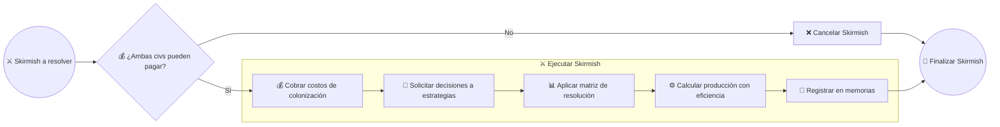
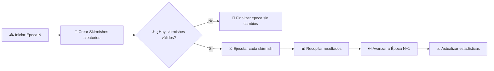

# 🚀 Análisis de Dominio: Interstellar War Dilemma

Conceptos del dominio para el juego, el core se basa en la toma de decisiones estratégicas entre 2 adversarios en un contexto de exploración espacial y colonización de cuerpos astronómicos. la desicion es simple, cooperar,  atacar o retirarse. El juego se desarrolla en rondas (épocas) donde las civilizaciones deben decidir cómo interactuar con los cuerpos astronómicos descubiertos y entre ellas mismas.

## 📋 Conceptos del Dominio

### 🏛️ Entidades Principales

#### 🏴‍☠️ **Civilization** (Entidad Central)
Mantiene logica de desición y recursos y expone estado.
  - **Estado**: `ACTIVE` -> (`DECLINING`, `DEAD`)
  - **Recursos**: `Resources` (Valor)
  1. Mantener recursos actuales
  2. Recibir recursos de producción por Epoca
  3. Pagar costos de colonización
  4. Ejecutar estrategia de decisión (Area de acción del jugador)

#### 🪐 **AstronomyBody** (Entity)
No gestiona procesos, solo expone estado y atributos.
  - **Estado**: `AVAILABLE` -> (`DISPUTED`, `LOST`)
  - **Costo de Colonización**: `ResourceEnum` (0-5)
  - **Produccion**: `ResourceEnum` (0-3)
  1. Ser el objetivo de disputa
  2. Gestionar reintentos de disputa

#### 💰 **ResourceProduction** (Entity)
Sin logica compleja, solo calcula y expone generacion de recursos.
  - **Civilizacion**: `Civilization`
  - **AstronomyBody**: `AstronomyBody`
  - **Participación**: `Participation` (FloatEnum)
  1. Resolver producción de recursos según participación
  2. Definir reglas de redondeo
  3. Controlar participación máxima (<=100%)

#### ⚔️ **Skirmish** (Entity)
Centraliza la lógica y datos de resolución y vincula las entidades relacionadas.
  - **Estados**: `CREATED` → `EXECUTED` → `RESOLVED`
  - **Civilizacion A**: `Civilization`
  - **Civilizacion B**: `Civilization`
  - **Decision A**: `Position`
  - **Decision B**: `Position`
  - **Resultado para A**: `SkirmishResult`
  - **Resultado para B**: `SkirmishResult`
  - **Producción A**: `ResourceProduction`
  - **Producción B**: `ResourceProduction`
  1. Cobrar costos de colonizacion
  2. Resolver resultado según matriz
  3. Definir porcentajes de produccion de recursos
  4. Validar si ambas civilizaciones pueden pagar

#### 🕰️ **Epoch** (Entity)
Gestiona agrupacion de skirmishes con sobre escrituras generada en el juego.
  - **Estado**: `FUTURE` -> `CURRENT` -> `HISTORIC`
  - **Skirmishes**: Lista de `Skirmish`
  1. Agrupar todos los skirmishes de una ronda
  2. Finalizar época y actualizar estados
  3. Llevar indice creciente de épocas

#### 🧠 **Memories** (Entity)
Almacena el historial completo de skirmishes, asi como permite consultas para analisis avanzado, lecturas en batch y eficientes.
  - **Epocas**: Lista de `Epoch`
  - **Propietario**: `Civilization`
  1. Registrar epocas de skirmishes filtrando por propietario
  2. Permitir análisis histórico
  3. Permitir consultas avanzadas

#### 🎮 **Game** (Aggregate Root)
Centraliza la coordinación, mecanicas especiales y reglas globales, delega detalles a entidades.
  - **Civilizaciones**: Lista de `Civilization`
  - **Memorias**: Lista de `Memories`
  1. Orquestar épocas secuenciales
  2. Mantener estadísticas globales
  3. Controlar estados de muerte
  4. Asegurar participación de todas las civilizaciones
  5. Gestionar eventos globales para suscitar dinamicas especiales de mecánicas

## 🔄 Objetos de Valor

### 💰 **Resources** `Float`
Cantidad de recursos a nivel general.

### 💳 **ResourceRange** `Range[x, y]`
Rango de recursos.
- Limite superior e inferior arbitrarios para recursos
1. Verificar si un valor está dentro del rango

### 🪙 **ResourcesEnum** `IntEnum`
Valores puntuales de `Resources`.

### 🪐 **AstroBodyResourcesProduction** `ResourcesEnum`
- `NONE`: `0`
- `LOW`: `1`
- `MEDIUM`: `2`
- `HIGH`: `3`

### 💸 **AstroBodyResourceCost** `ResourcesEnum`
- `WITH_INFRAESTRUCTURE`: `0`
- `TERRAFORMED`: `1`
- `HABITABLE`: `2`
- `NEED_TERRAFORM`: `3`
- `HOSTILE`: `4`
- `EXTREME`: `5`

### 🤺 **Position** `Enum`
- 🤝 `COOPERATE`: Decisión colaborativa
- ⚔️ `ATTACK`: Decisión agresiva  
- 🤡 `NOTHING`: Fallo en decisión o declinacion por retiro

### 🥧 **Participation**  `Float`
Porcentaje de participación en la producción de recursos (`ResourceProduction`) para una `Civilization`.

### 🍰 **ParticipationStandard**  `FloatEnum`
Valores estandar sobre porcentaje de participación en la producción de recursos (`ResourceProduction`).
| Resultado        | Eficiencia | Position (A) | Opponent Position (B) |
|------------------|------------|--------------|-----------------------|
| 🟡 `COOPERATION` | `0.5`      | `COOPERATE`  | `COOPERATE`           |
| 🟢 `ASIMILATION` | `0.83`     | `COOPERATE`  | `NOTHING`             |
| 🟡 `MASSACRE`    | `0.66`     | `ATTACK`     | `NOTHING`             |
| 🟠 `CONFLICT`    | `0.17`     | `ATTACK`     | `ATTACK`              |
| 🔴 `NOTHING`     | `0.0`      | `NOTHING`    | `NOTHING`             |
1. Determinar el porcentaje de participación para una Civ, en función de la decisiónes tomada y la de oponente.

### 🤼 **SkirmishResult** `Enum`
Consideracion del resultado de un skirmish entre dos civilizaciones.
| Resultado          | Decisión A        | Decisión B         | Eficiencia (%) |
|--------------------|-------------------|--------------------|----------------|
| 🔵 **COOPERATION** | 🤝 `COOPERATE`    | 🤝 `COOPERATE`     | 100%           |
| 🟢 **TREASON**     | ⚔️ `ATTACK`       | 🤝 `COOPERATE`     | 83%            |
| 🟠 **CONFLICT**    | ⚔️ `ATTACK`       | ⚔️ `ATTACK`        | 33%            |
| 🟢 **ASIMILATION** | 🤝 `COOPERATE`    | 🤡 `NOTHING`       | 83%            |
| 🟡 **MASSACRE**    | ⚔️ `ATTACK`       | 🤡 `NOTHING`       | 66%            |
| 🔴 **LOOSE**       | 🤡 `NOTHING`      | 🤡 `NOTHING`       | 0%             |

### 🚦 **SkirmishStatus** `Enum`
- `CREATED`: Skirmish creado, esperando ejecución
- `EXECUTED`: Costos pagados, decisiones tomadas
- `RESOLVED`: Recursos distribuidos, guardado en memoria

### 🎴 **AstronomyBodyStatus** `Enum`
- `DISCOVERED`: AstronomyBody descubierto, esperando disputa
- `CONTROLLED`: Al menos una civilización obtuvo recursos
- `DISPUTED`: Ambas civilizaciones fallaron, se vuelve a disputar en la siguiente época
### 🔭 **AstronomyBodyType** `StrEnum`
| Subtipo               | Categoría     | Producción | Costo | Descripción / Efectos | Rareza       |
|-----------------------|---------------|------------|-------|-----------------------|--------------|
| `EXOPLANET`           | 🪐 Planeta    | 2-3        | 2-4   | Exploración avanzada  | Raro         |
| `MINOR_PLANET`        | 🪐 Planeta    | 1          | 0-1   | Fácil de colonizar    | Común        |
| `DWARF_PLANET`        | 🪐 Planeta    | 1-2        | 1-2   | Terraformación moderada| Poco común   |
| `GAS_GIANT`           | 🪐 Planeta    | 3          | 5     | Recursos fluctuantes  | Poco común   |
| `ICE_GIANT`           | 🪐 Planeta    | 2          | 5     | Bonificación defensa  | Poco común   |
| `ROCKY_PLANET`        | 🪐 Planeta    | 1          | 0-1   | Acceso fácil          | Común        |
| `VOLCANIC_PLANET`     | 🪐 Planeta    | 1-3        | 3     | Eventos aleatorios    | Raro         |
| `OCEAN_WORLD`         | 🪐 Planeta    | 2          | 4     | Exploración especial  | Raro         |
| `DESERT_PLANET`       | 🪐 Planeta    | 1          | 0-1   | Colonización fácil    | Común        |
| `FOREST_WORLD`        | 🪐 Planeta    | 2          | 2     | Bonificación ecológica| Muy raro     |
| `TOXIC_WORLD`         | 🪐 Planeta    | 1          | 4     | Efectos negativos     | Raro         |
| `MAGNETIC_PLANET`     | 🪐 Planeta    | 1-3        | 3     | Tecnología especial   | Raro         |
| `RADIATION_WORLD`     | 🪐 Planeta    | 1          | 5     | Penalización recursos | Raro         |
| `TIDAL_LOCKED_PLANET` | 🪐 Planeta    | 1-3        | 3     | Eventos de ciclo      | Raro         |
| `BINARY_PLANET`       | 🪐 Planeta    | 3          | 5     | Producción combinada  | Muy raro     |
| `MOON`                | 🌙 Luna       | 2          | 1     | Colonización inicial  | Común        |
| `CAPTURED_MOON`       | 🌙 Luna       | 1          | 0-1   | Bajo riesgo           | Poco común   |
| `ASTEROID`            | 🪨 Asteroide  | 1          | 0-1   | Minería abundante     | Común        |
| `ASTEROID_BELT`       | 🪨 Asteroide  | 1          | 1     | Producción constante  | Poco común   |
| `COMET`               | 🪨 Asteroide  | 1-3        | 3     | Eventos únicos        | Raro         |
| `STAR`                | ⭐ Estelar    | 3          | 5     | Energía principal     | Raro         |
| `QUASAR`              | ⭐ Estelar    | 3          | 5     | Evento de radiación   | Muy raro     |
| `PULSAR`              | ⭐ Estelar    | 2          | 5     | Tecnología y memoria  | Muy raro     |
| `BLACK_HOLE`          | ⭐ Estelar    | 0-3        | 5     | Teletransporte        | Muy raro     |
| `NEBULA`              | ⭐ Estelar    | 2          | 4     | Colonización especial | Raro         |
| `DARK_MATTER_CLUSTER` | ⭐ Estelar    | 1-3        | 5     | Bonificación tecnológica| Muy raro   |
| `GALAXY_CORE`         | ⭐ Estelar    | 3          | 5     | Eventos finales       | Extremo raro |
| `SPACE_STATION`       | 🏗️ Artificial | 2          | 4     | Defensa y alianzas    | Poco común   |
| `STELLAR_STRUCTURE`   | 🏗️ Artificial | 1-3        | 3-4   | Efectos especiales    | Muy raro     |
| `DYSON_SPHERE`        | 🏗️ Artificial | 3          | 5     | Mecánica de victoria  | Extremo raro |
| `RING_WORLD`          | 🏗️ Artificial | 3          | 5     | Bonificación global   | Muy raro     |
| `PLANETARY_SYSTEM`    | 🏗️ Artificial | 3          | 5     | Expansión combinada   | Muy raro     |
| `WORM_HOLE`           | 🏗️ Artificial | 0          | 5     | Movimiento especial   | Extremo raro |

**Niveles de rareza:**  
- Común  
- Poco común  
- Raro  
- Muy raro  
- Extremadamente raro


## 🧩 Relaciones entre Entidades

### 📊 Diagrama de Entidades y Relaciones


### ⏳ Proceso de Iteración de Época (Tick)


### 🤼 Proceso de Resolucion de Skirmish


## 📊 Matriz de Resolución de Skirmishes

| Civ A ↓ / Civ B → | 🤝 **COOPERATE** | ⚔️ **ATTACK** | 🤡 **NOTHING** |
|-------------------|------------------|---------------|----------------|
| 🤝 **COOPERATE**     | 🟡 A: 3/6 - 50% <br/>🟡 B: 3/6 - 50% | 🔴 A: 0/6 - 0% <br/>🟢 B: 5/6 - 83% | 🟢 A: 5/6 - 83% <br/>🔴 B: 0/6 - 0% |
| ⚔️ **ATTACK**        | 🟢 A: 5/6 - 83% <br/>🔴 B: 0/6 - 0% | 🟠 A: 1/6 - 17% <br/>🟠 B: 1/6 - 17%  | 🟡 A: 4/6 - 66% <br/>🔴 B: 0/6 - 0% |
| 🤡 **NOTHING**       | 🔴 A: 0/6 - 0% <br/>🟢 B: 5/6 - 83% |  🔴 A: 0/6 - 0% <br/>🟡 B: 4/6 - 66% | 🔴 A: 0/6 - 0% <br/>🔴 B: 0/6 - 0% |

### 📈 Analisis de eficiencia de aprovechamiento de recursos
- 🔵 **Cooperación mutua**: Máximo aprovechamiento conjunto (50%-50%)
- 🟢 **Traición**: El agresor logra mayor aprovechamiento (83% vs 0%)
- 🟢 **Asimilacion**: Aprovechamiento alto sin agresion (83% vs 0%)
- 🟡 **Masacre**: Aprovechamiento moderado, pero desperdicio (66%-0%)
- 🟠 **Conflicto mutuo**: Mínimo aprovechamiento, máximo desperdicio (17%-17%)
- 🔴 **Perdida total**: AstronomyBody se marca como `DISPUTED`, si se repite → `LOST` permanentemente

### 🎯 Rangos de AstronomyBodies:
- **Asteroid**: Costo 1, Producción 1 *(abundante, bajo riesgo)*
- **Moon**: Costo 2, Producción 2 *(equilibrado)*
- **Planet**: Costo 3, Producción 3 *(alto valor, alto riesgo)*

### **Example: Distribución de Recursos**
```
🌙 Luna (base_production: 3)
   ├─ Skirmish: Civ_A(COOPERATE) vs Civ_B(COOPERATE)
   ├─ Matriz: A=50% | B=50% 
   ├─ Distribución: A=1.5 | B=1.5
   └─ Resultado: Ambas reciben 1.5 recursos → A+2, B+2 (redondeado)

🪨 Asteroid (base_production: 1)  
   ├─ Skirmish: Civ_A(ATTACK) vs Civ_B(COOPERATE)
   ├─ Matriz: A=83% | B=0%
   ├─ Distribución: A=0.83 | B=0
   └─ Resultado: Solo A recibe 1 recurso
```


## 🎯 Flujo de Procesos

### **Proceso: Ejecutar Skirmish**


### **Proceso: Ejecutar Época**



## 🧠 Sistema de Memoria Global

### **MemoryEntry** (Entity)
```
- id: MemoryEntryId
- skirmish_id: SkirmishId
- civ_a_id: CivilizationId
- civ_b_id: CivilizationId
- astronomy_body_id: AstronomyBodyId
- astronomy_body_production: Int (0-3)
- decision_a: Position
- decision_b: Position
- efficiency_a: Float (0.0-1.0)
- efficiency_b: Float (0.0-1.0)
- resources_gained_a: Float
- resources_gained_b: Float
- astronomy_body_status: AstronomyBodyStatus
- epoch: Int
```

### **MemoryAccess** (Filtro por Civilización)
```
- owner_id: CivilizationId
- access_level: MemoryAccessLevel (OWN, ALLIED, GLOBAL)
- limit: Int (default: 100, expandible con mecánicas futuras)
```

### **Queries de Memoria Mejoradas**:
- `getEncountersWith(opponent)`: Historial con civilización específica
- `calculateCooperationSuccessRate()`: % de veces que cooperar dio resultado positivo
- `analyzeOpponentBehavior(opponent)`: Patrones de comportamiento del oponente
- `getResourceTrends(opponent)`: Tendencias históricas de recursos del oponente
- `analyzeCivilizationState(opponent)`: Estado actual vs histórico del oponente
- `evaluateAstronomyBodyProfitability(body)`: Rentabilidad histórica de un AstronomyBody
- `recommendAction(body, opponent, current_resources)`: Sugerencia basada en análisis completo
- `getDeathWatch()`: Lista de civilizaciones en riesgo de muerte (próximas 2 épocas)


## 🎮 Interfaces de Estrategia

### **Strategy Protocol**
```python
def decide(
    astronomy_body: AstronomyBody,  # Incluye costo y producción
    opponent: Civilization,         # Info básica del oponente
    memory_access: MemoryAccess,    # Acceso filtrado a memorias
    current_resources: Int          # Recursos actuales (0-6+)
) -> Position
```

### **Invariantes del Dominio**:
- Las civilizaciones inician con 6 recursos
- Los recursos nunca pueden ser negativos
- Cada época, todas las civilizaciones deben participar
- AstronomyBodies producen entre 0-3 recursos
- Costos de colonización van de 0-3 recursos
- Eficiencias de la matriz siempre suman ≤ 100% por par

### **Ejemplos de Estrategias**:
1. **AlwaysCooperate**: Siempre coopera
2. **AlwaysAttack**: Siempre ataca  
3. **TitForTat**: Imita la última acción del oponente
4. **Grudger**: Coopera hasta ser traicionado, luego siempre ataca
5. **Random**: Decisión aleatoria
6. **ResourceBased**: Decide según recursos disponibles vs costo
7. **MemoryAnalyst**: Analiza historial completo antes de decidir
8. **OpponentTracker**: Se especializa en rastrear patrones de comportamiento
9. **ProfitMaximizer**: Siempre busca máximo retorno de inversión
10. **Survivor**: Prioriza supervivencia sobre ganancias


## 🔮 Extensiones Futuras

### **Mecánicas Avanzadas**:
1. **Exploración Interestelar**:
   - Permitir "divisar" astronomy bodies futuros
   - Costo en recursos para explorar
   - Información parcial sobre targets

2. **Worm Holes**:
   - Requiere exploración previa
   - Permite influir en probabilidad de encounters
   - Costo premium en recursos

3. **Tecnologías**:
   - Mejoras de eficiencia de producción
   - Reducción de costos de colonización
   - Nuevas opciones de decisión

4. **Diplomacia**:
   - Alianzas temporales
   - Pactos de no agresión
   - Intercambio directo de recursos

### **Tipos de AstronomyBody**:
- **Planet**: Alto costo, alta producción, estable
- **Moon**: Costo medio, producción media, vinculado a planetas
- **Star**: Altísimo costo, altísima producción, muy raro
- **Stellar Structure**: Costo variable, producción especializada
- **Asteroid**: Bajo costo, baja producción, abundante
- **Space Station**: Costo premium, producción eficiente, tecnológico


## 🚀 Mecánicas Futuras - Brainstorming

### **🤝 Sistema de Alianzas**:
- **Compartir Memorias**: Aliados acceden a memoria histórica mutua
- **Intercambio de Recursos**: Trueques automáticos o manuales
- **Coordinación de Estrategias**: Decisiones conjuntas en algunos skirmishes
- **Duración**: Alianzas temporales (X épocas) o hasta traición

### **🔭 Exploración Interestelar**:
- **Prospección**: Gastar recursos para ver AstronomyBodies de futuras épocas
- **Información Parcial**: Solo tipo y costo, no producción exacta
- **Ventaja Estratégica**: Preparación para targets valiosos

### **🌌 Worm Holes**:
- **Requisito**: Exploración previa del target
- **Funcionalidad**: Aumentar probabilidad de ser asignado a AstronomyBody específico
- **Costo Premium**: Muy caro pero estratégicamente valioso

### **⚙️ Tecnologías**:
- **Eficiencia de Producción**: Multiplicadores en recursos obtenidos
- **Reducción de Costos**: Descuentos en colonización
- **Nuevas Opciones**: Decisiones adicionales como "SABOTAGE" o "FORTIFY"
- **Árbol Tecnológico**: Prerrequisitos y especializaciones

### **📊 Análisis Avanzado**:
- **Predicción de Comportamiento**: IA que predice decisiones de oponentes
- **Simulador de Scenarios**: Probar estrategias sin gastar recursos
- **Market Intelligence**: Análisis de tendencias del "mercado" de AstronomyBodies

### **🎲 Eventos Aleatorios**:
- **Catástrofes**: Pérdida súbita de recursos
- **Discoveries**: Bonificaciones inesperadas
- **Mercado Fluctuante**: Cambios en costos/producciones de AstronomyBodies

### **💾 Expansión de Memoria**:
- **Límite Base**: 100 entradas por civilización
- **Upgrades**: Tecnologías que expanden capacidad
- **Memoria Especializada**: Tipos específicos de memoria (combate, recursos, diplomacia)


## 🎲 Mecánicas de Aleatoriedad

### **Asignación de Skirmishes**:
- **Obligatorio**: Todas las civilizaciones deben participar cada época
- **Números impares**: El juego agrega automáticamente una "NeutralCivilization" con estrategia aleatoria
- **Emparejamiento**: Aleatorio pero garantizando que todos participen
- **Restricción**: Solo si ambas pueden pagar (civilizaciones pobres saltan la época)

### **Gestión de Civilizaciones en Quiebra**:
- **Estado de Muerte**: Se activa cuando no pueden pagar ningún AstronomyBody durante 2 épocas consecutivas
- **Supervivencia**: Tienen 2 épocas adicionales para recuperarse antes de eliminación definitiva
- **Interacción**: Pueden seguir siendo atacadas pero no pueden iniciar skirmishes

### **Variabilidad Futura**:
- Eventos aleatorios que afectan recursos
- Astronomy bodies que aparecen/desaparecen
- Modificadores temporales de eficiencia


## 📊 Métricas y Análisis

### **Estadísticas por Civilización**:
- Total de recursos actuales
- Número de skirmishes ganados/perdidos/empatados
- Tasa de cooperación histórica
- Eficiencia promedio obtenida
- Astronomy bodies controlados

### **Estadísticas Globales**:
- Distribución de recursos entre civilizaciones
- Patrones de comportamiento emergentes
- Astronomy bodies más disputados
- Evolución de estrategias a lo largo del tiempo


## 📖 Glossary
- **Tick**: Una iteración del juego con determinada duracion de tiempo, donde se ejecutan todos los *Events* y `Skirmishes` en una `Epoch`.